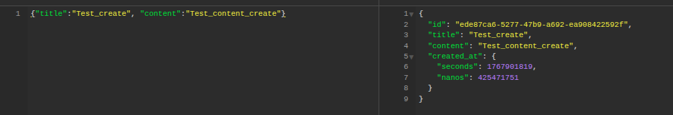

# Sberbank тестовое задание

Микросервисное приложение для управления задачами, написанное на Go с использованием gRPC, PostgreSQL, Redis и Kafka с запуском через Docker и тестированием

**АР1-сервис, должны быть реализованы:**
- POST /create: создать задачу
- GET /list: получить список задач
- DELETE /delete: удалить задачу 
- PUT /done: выполнить задачу

API-сервис проксирует пользовательские запросы в DB-Service

**БД-сервис, должны быть реализованы:**
- Запросы от API-сервиса через gRPC
- Кеширование в Redis задач, с которыми взаимодействовал пользователь. Настроить TTL

**Kafka-сервис, должны быть реализованы:**
- API-сервис при каждом действии пользователя отправляет в Kafka информацию о событии
- Kafka-сервис вычитывает из кафки все сообщения и логгирует их в файл 

**Тесты**:
- Покрыть тестами api-handlers

## 🏗️ Архитектура

Проект состоит из трех основных сервисов:

- **API Service** (`cmd/api`) - REST API сервис на Gin, предоставляющий HTTP endpoints для работы с задачами
- **DB Service** (`cmd/db`) - gRPC сервер, обрабатывающий бизнес-логику и работу с базой данных
- **Kafka Logger** (`cmd/kafka-logger`) - сервис для логирования событий из Kafka в файл

## 📡 Работа API Endpoints

### Создать задачу
```http
POST /create
Content-Type: application/json

{
  "title": "Название задачи",
  "content": "Описание задачи"
}
```

**Ответ:**


### Получить список задач
```http
GET /list
```

**Ответ:**


### Удалить задачу
```http
DELETE /delete
Content-Type: application/json

{
  "id": "uuid"
}
```

**Ответ:**


### Отметить задачу как выполненную
```http
PUT /done
Content-Type: application/json

{
  "id": "uuid"
}
```

**Ответ:**


## 🧪 Тестирование

Запуск тестов:
```bash
go test ./...
```

Запуск тестов с покрытием:
```bash
go test -coverprofile=coverage.out ./...
go tool cover -html=coverage.out -o coverage.html
```


## 🔧 Конфигурация

Все настройки конфигурируются через переменные окружения с префиксом `CHECKLIST_`:

- `CHECKLIST_API_PORT` - порт для API сервиса (по умолчанию: 8080)
- `CHECKLIST_DB_GRPC_URL` - адрес gRPC сервера DB сервиса
- `CHECKLIST_DB_GRPC_PORT` - порт для gRPC сервера (по умолчанию: 50051)
- `CHECKLIST_DB_POSTGRES_DSN` - строка подключения к PostgreSQL
- `CHECKLIST_REDIS_ADDR` - адрес Redis сервера
- `CHECKLIST_KAFKA_BROKER` - адрес Kafka брокера
- `CHECKLIST_KAFKA_TOPIC` - название топика Kafka
- `CHECKLIST_KAFKA_LOG_FILE` - путь к файлу логов Kafka

## 💾 Кэширование

Система использует Redis для кэширования:
- Отдельные задачи кэшируются на 60 секунд
- Список задач кэшируется на 15 секунд
- Кэш автоматически инвалидируется при создании, обновлении или удалении задач

## 📊 Логирование событий

Все операции с задачами логируются в Kafka:
- `create` - при создании задачи
- `list` - при получении списка задач
- `delete` - при удалении задачи
- `mark_done` - при отметке задачи как выполненной

События обрабатываются Kafka Logger сервисом и записываются в файл логов (logs/kafka.log)


